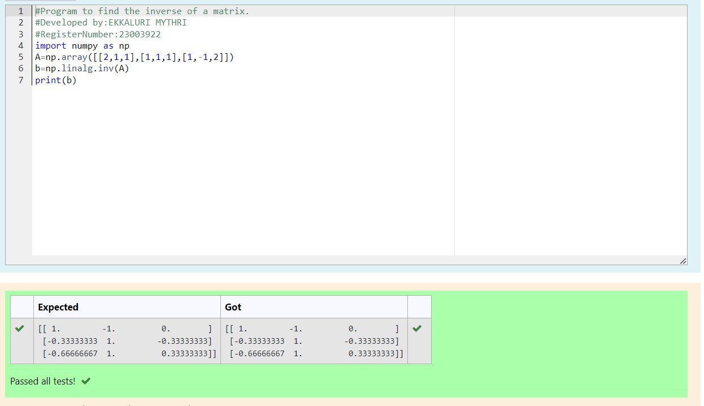

# INVERSE-OF-A-MATRIX
## Aim:
To write a python program to find the inverse of a matrix
## Equipment’s required:
1. 	Hardware – PCs
2. 	Anaconda – Python 3.7 Installation / Moodle-Code Runner
## Algorithm:
### Step1 :
initialize the program with import numpy 
### Step 2:
get input from user and store it in the variable A 
### Step 3:
we can inverse the matrix using linalg.inv() 
### Step 4:
End the program 

## Program:
```
#Program to find the inverse of a matrix.
#Developed by:EKKALURI MYTHRI
#RegisterNumber:23003922
import numpy as np
A=np.array([[2,1,1],[1,1,1],[1,-1,2]])
b=np.linalg.inv(A)
print(b)
```
## Output:

## Result:
Thus the inverse of given matrix is successfully solved using python program

